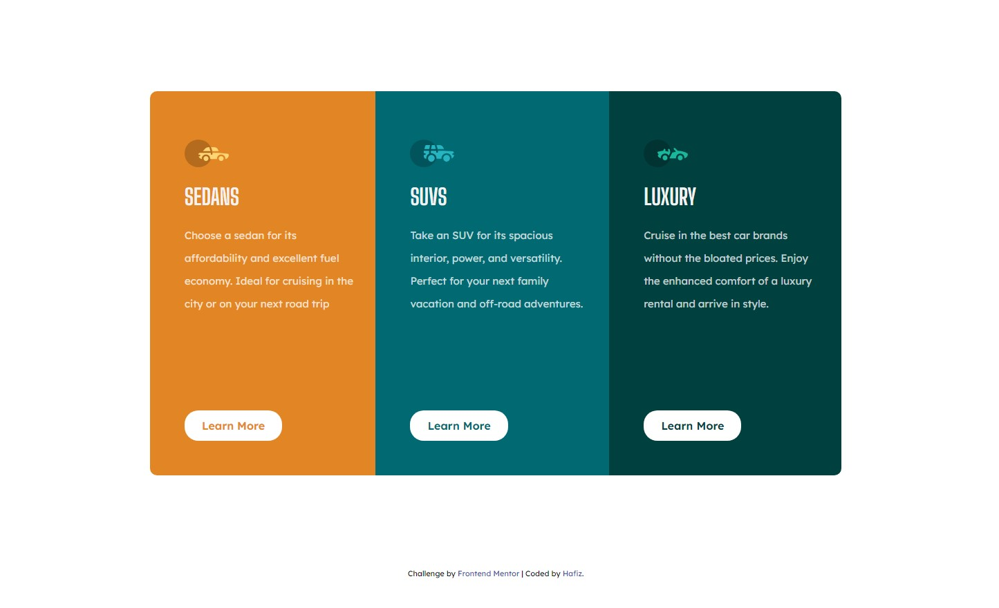
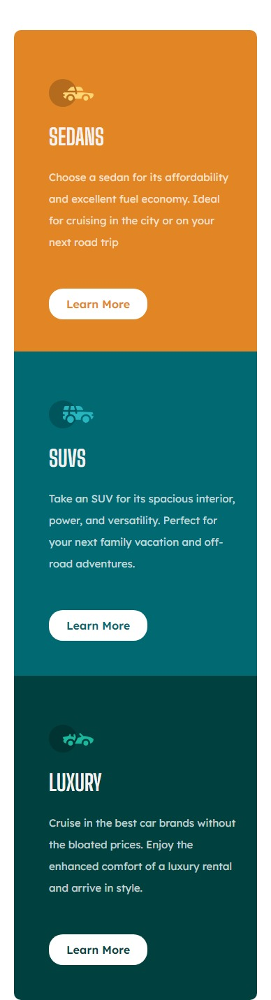

# Frontend Mentor - 3-column preview card component solution

This is a solution to the [3-column preview card component challenge on Frontend Mentor](https://www.frontendmentor.io/challenges/3column-preview-card-component-pH92eAR2-). Frontend Mentor challenges help you improve your coding skills by building realistic projects. 

## Table of contents

- [Overview](#overview)
  - [The challenge](#the-challenge)
  - [Screenshot](#screenshot)
  - [Links](#links)
- [My process](#my-process)
  - [Built with](#built-with)
  - [What I learned](#what-i-learned)
  - [Continued development](#continued-development)
  - [Useful resources](#useful-resources)
- [Author](#author)
- [Acknowledgments](#acknowledgments)

## Overview

### The challenge

The challenge is design 3 column card component.

### Screenshot

### Links

- Solution URL: https://github.com/Hafizshkr/3-column-preview-card-component.git
- Live Site URL: https://3-column-preview-card-component-theta-dusky.vercel.app/

### Built with

- HTML
- CSS custom properties

### What I learned

What I've learned from this project is how to handle CSS, including how to organize boxes using flex-direction and how to center content. This project has been really helpful for me in improving areas where I lacked skills.

### Continued development

I need to focus on how CSS works, especially when working on responsive design. It's like my weakness, but I need to improve in that area.

### Useful resources

- [Example resource 1](https://www.w3schools.com/cssref/css3_pr_flex-direction.php) - This helped me for to understand how the flex direction works.

# Product-preview-card
